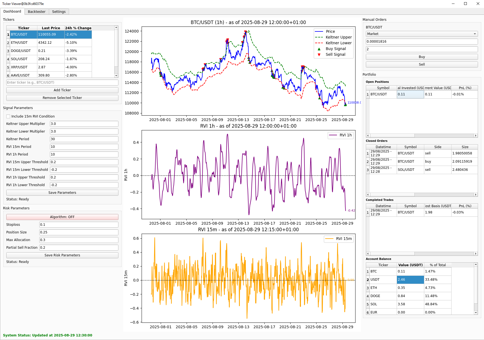
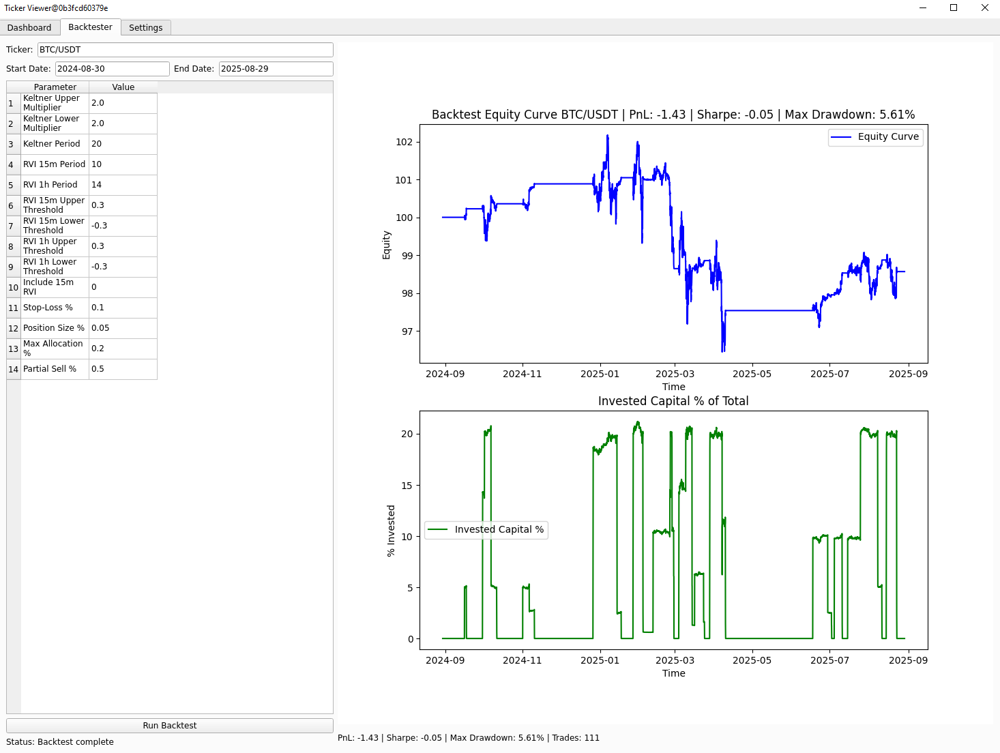

# Crypto Trader — Signals, Backtests & One‑Click Orders

## What
A desktop app to **explore trading ideas** and **execute trades** from the same screen. Tune parameters, regenerate signals, run quick backtests, and submit orders through your exchange account.

<p align="center">
  
</p>

---

## Why
- **Tight loop:** tweak → see signals → backtest → place trade — all in one place.  
- **Desktop‑first:** fast, focused PyQt6 UI without browser clutter.  
- **Practical stack:** ccxt + PostgreSQL keep data and execution reliable and portable.

---

## Features
- **Dashboard:** Price chart with **Keltner Channels**, **RVI**, and **buy/sell markers**.  
  Signal & risk controls on the left; orders & portfolio on the right.
- **Signals:** Independent Keltner multipliers/periods, RVI thresholds, optional **15m RVI filter**.  
  Signals combine into a single **final signal** used for backtests & execution.
- **Backtester:** Single‑asset runs with summary metrics and a visual of the test period.  
- **Trading:** Market/Limit orders to **Bitget** (via **ccxt**); a background worker tracks fills.  
- **Portfolio:** Open/closed positions view updated as orders fill.  
- **Storage:** Candles, indicators, and signals in **PostgreSQL** (via **SQLAlchemy**).  
- **Cross‑platform:** Windows, macOS, Linux (Python 3.11+).

<p align="center">
  
</p>

**Tech used**
- **Python 3.11+**, **PyQt6**, **Matplotlib**
- **ccxt** (Bitget) for trading; **yfinance** for quick quotes
- **PostgreSQL** via **SQLAlchemy**
- Utility deps: `tenacity`, `schedule`, `python-dateutil`
- Packaging / Deployment: **requirements.txt**, **Dockerfile**, **docker-compose.yml**, Windows helpers: **install.bat**, **start_gui.bat**, **uninstall.bat**

---

## Getting Started

> Choose one path below (Windows scripts, Manual install, or Docker). All paths assume you have a PostgreSQL instance available and exchange API credentials ready.

### Option A — Windows (one‑click scripts)
1. **Install**: double‑click `install.bat` (creates `.venv` and installs from `requirements.txt`).  
2. **Run the app**: double‑click `start_gui.bat`.  
3. **Uninstall (optional)**: double‑click `uninstall.bat` to remove the virtual env and cached artifacts.  

> If your antivirus blocks scripts, allow them or run from an elevated PowerShell window.

### Option B — Manual (cross‑platform)
1) **Create and activate a virtual environment**
```bash
python -m venv .venv
# Windows (PowerShell)
. .venv/Scripts/Activate.ps1
# Windows (Git Bash)
source .venv/Scripts/activate
# macOS/Linux
# source .venv/bin/activate
```
2) **Install dependencies**
```bash
pip install -U pip wheel
pip install -r requirements.txt
```
3) **Configure PostgreSQL (environment variables)**
```bash
# Bash (macOS/Linux/Git Bash)
export POSTGRES_HOST=127.0.0.1
export POSTGRES_PORT=5432
export POSTGRES_DB=crypto_trader
export POSTGRES_USER=postgres
export POSTGRES_PASSWORD=postgres
```
```powershell
# Windows PowerShell (persists for new shells)
setx POSTGRES_HOST 127.0.0.1
setx POSTGRES_PORT 5432
setx POSTGRES_DB crypto_trader
setx POSTGRES_USER postgres
setx POSTGRES_PASSWORD postgres
```
4) **Add exchange API credentials (Bitget via ccxt)**  
Create `~/.crypto_trading_api_credentials` with three lines:
```
<API_KEY>
<API_SECRET>
<API_PASSPHRASE>
```
> On Unix, restrict permissions: `chmod 600 ~/.crypto_trading_api_credentials`
5) **Run the app**
```bash
# Most setups
python -m app.ui.main_window
# Or, if you keep a top-level script
python main.py
```

### Option C — Docker / Docker Compose
> Best for repeatable dev environments and headless runs. Running a **GUI in Docker** may require additional host configuration (X11/WSLg/Wayland); the native (A/B) paths are recommended for desktop use.

**Using Docker Compose (recommended):**
1. Ensure **docker** and **docker compose** are installed.  
2. Create a `.env` file (same folder as `docker-compose.yml`) with your DB settings:
```
POSTGRES_HOST=host.docker.internal
POSTGRES_PORT=5432
POSTGRES_DB=crypto_trader
POSTGRES_USER=postgres
POSTGRES_PASSWORD=postgres
```
3. Build & start:
```bash
docker compose up -d --build
# or (older)
# docker-compose up -d --build
```
4. View logs / stop:
```bash
docker compose logs -f
docker compose down
```

**Using raw Docker:**
```bash
# Build image
docker build -t crypto-trader .

# Run container (pass envs or --env-file .env)
docker run --rm \
  -e POSTGRES_HOST=host.docker.internal \
  -e POSTGRES_PORT=5432 \
  -e POSTGRES_DB=crypto_trader \
  -e POSTGRES_USER=postgres \
  -e POSTGRES_PASSWORD=postgres \
  crypto-trader
```

> **API credentials in Docker:** either bake them as build args/secrets or mount a file into the container (e.g., `-v ~/.crypto_trading_api_credentials:/root/.crypto_trading_api_credentials:ro`).

---

## Documentation
- **Core components:** Dashboard, Signal Engine (Keltner + RVI + optional 15m filter), Backtester, Orders & Portfolio.  
- **Usage flow:** select ticker & timeframe → adjust params → regenerate signals → (optional) backtest → place order.  
- **Notes:** Candles/signals stored in **UTC**; UI can display local time.

---

## Roadmap
- Batch backtests & parameter sweeps  
- Strategy plug‑ins (more indicators/filters)  
- Risk overlays on chart (stops/targets)  
- CSV/Parquet export  
- Dockerized dev setup

---

## License
This project is licensed under the **MIT License** — see [LICENSE](LICENSE) for details.

